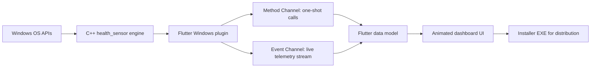
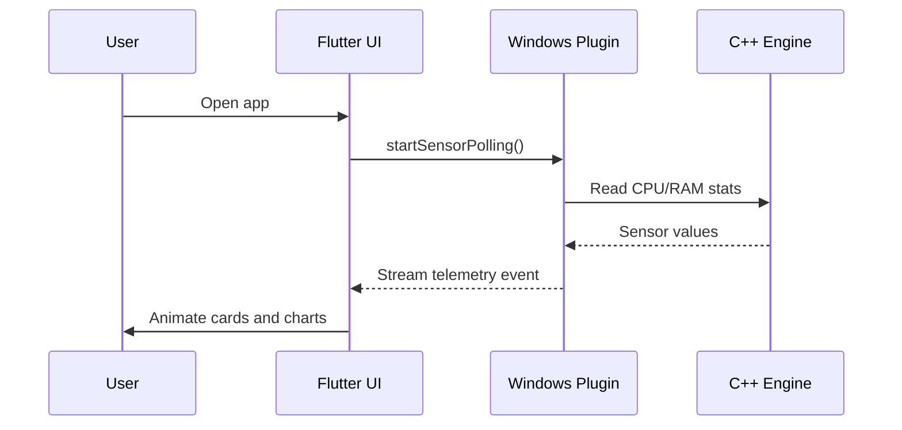

<<<<<<< HEAD
# Probe IT

> Deep CPU Analyser for Windows, built as a Flutter plugin with a C++ engine bridge, live telemetry, animated splash UI, and a clean installer workflow.

---

## Hero

```text
  ____                 ____ ___ _______
 |  _ \ ___  __ _  ___|  _ \_ _|__  / _|
 | |_) / _ \/ _` |/ __| |_) | |  / / |_ 
 |  __/  __/ (_| | (__|  __/| | / /|  _|
 |_|   \___|\__,_|\___|_|  |___/___|_|  
```

Probe IT is a Windows desktop monitoring project that connects a Flutter UI to a native C++ health engine. It is designed to feel modern, educational, and practical, with a polished splash screen, live sensor data, and a distributable installer.

---

## What This Project Does

- Reads live CPU, RAM, page-file, and virtual-memory data from a native C++ engine.
- Streams those metrics into Flutter using platform channels.
- Displays an animated dashboard with a branded splash screen.
- Packages the app into a single Windows installer EXE.
- Keeps the codebase open-source and easy to inspect.

---

## Project Story

This project started as a Windows Flutter plugin experiment and became a full desktop monitoring application.

The core idea is simple:

1. C++ gathers the machine health data.
2. Flutter receives the data through method and event channels.
3. The UI turns raw numbers into a readable and visually rich dashboard.
4. Inno Setup packages everything into a shareable installer.

---

## High-Level Architecture



---

## Data Flow



---

## Core Features

| Area | Description |
| --- | --- |
| Native engine | C++ reads system health values directly from Windows APIs. |
| Flutter UI | Modern desktop dashboard with animated splash and clean cards. |
| Live telemetry | Event channel keeps the dashboard updated in real time. |
| Installer | Inno Setup builds a single downloadable Windows installer EXE. |
| Open-source ready | MIT license and GitHub-friendly release flow. |

---

## Screens and Motion

The app is designed to feel alive rather than static.

- A branded splash screen introduces the app with motion and layered visuals.
- The dashboard can be expanded with charts, status rings, and animated metric cards.
- The release installer adds a friendly student-project message before installation.

If you want to push the visual style further, the next upgrades could be:

- A subtle parallax background on the splash screen.
- Animated gauge rings for CPU and memory.
- A timeline graph for live telemetry.
- A dark/light theme switch for better presentation.

---

## Tech Stack

- Flutter
- Dart
- C++
- Windows desktop plugin APIs
- Inno Setup
- Mermaid for documentation diagrams

---

## What Makes It Interesting

This project is not just a UI wrapper.
It combines:

- a native Windows data engine,
- a Flutter desktop experience,
- live streaming telemetry,
- custom splash branding,
- and a real installer pipeline.

That makes it a good example of how Flutter can be used for serious desktop tooling, not just mobile apps.

---

## Next Ideas

- Add charts for historical CPU and memory usage.
- Add tray icon support on Windows.
- Add export to CSV or JSON.
- Add a settings page for polling interval and theme.
- Add signed builds for public release.

---

## Short Project Summary

Probe IT is a Windows desktop monitoring app that uses a native C++ engine and a Flutter UI to deliver live CPU and memory insights in a polished, installer-ready package.
=======
# cpu_analyser

A new Flutter plugin project.

## Getting Started

This project is a starting point for a Flutter
[plug-in package](https://flutter.dev/to/develop-plugins),
a specialized package that includes platform-specific implementation code for
Android and/or iOS.

For help getting started with Flutter development, view the
[online documentation](https://docs.flutter.dev), which offers tutorials,
samples, guidance on mobile development, and a full API reference.

The plugin project was generated without specifying the `--platforms` flag, no platforms are currently supported.
To add platforms, run `flutter create -t plugin --platforms <platforms> .` in this directory.
You can also find a detailed instruction on how to add platforms in the `pubspec.yaml` at https://flutter.dev/to/pubspec-plugin-platforms.
>>>>>>> 83a1292 (Update with the source code)
